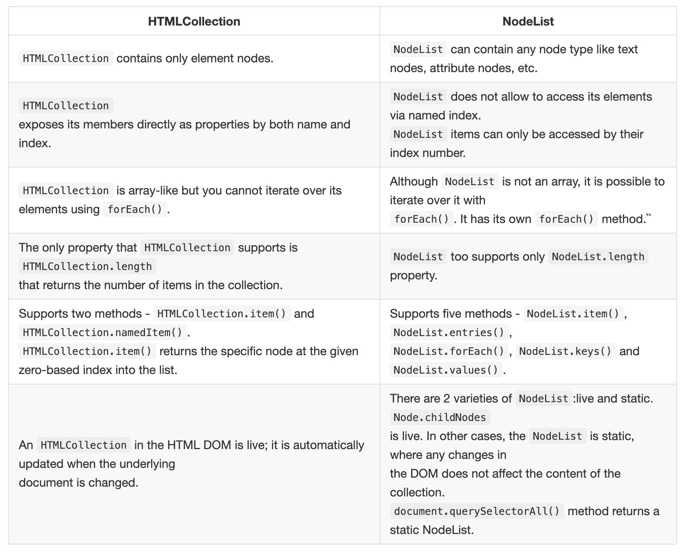
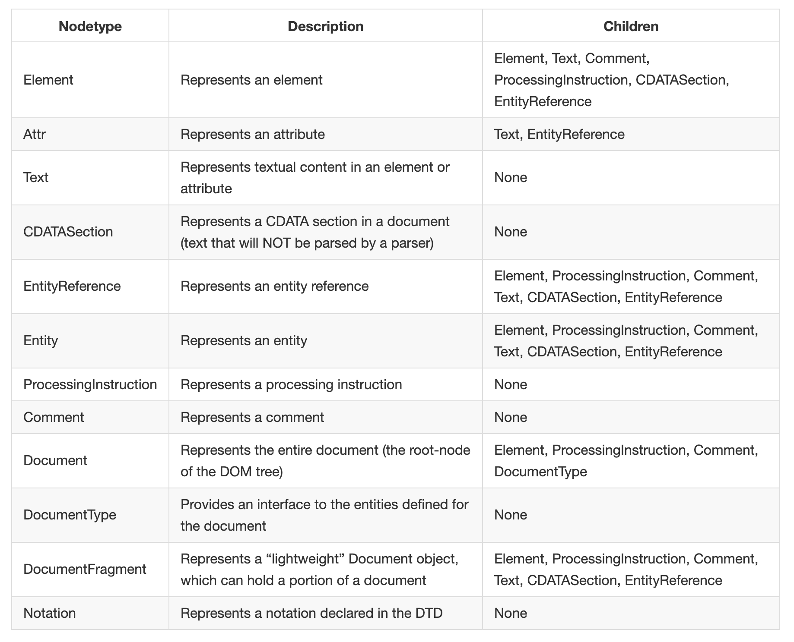
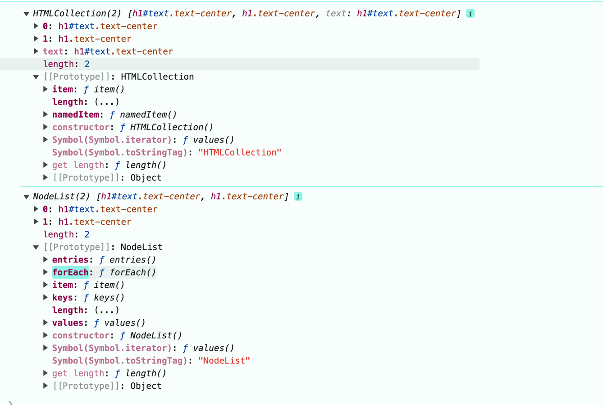

## lesson-11

- Data type
- Operators 
- Function
- Array
- Object
- HOF
- MEMORY 
- this
- Loops

++ JavScript 

OOP
REGEX
MAP , SET , WEAKMAP , WEAKSET, GENERATOR
PROMISE
js Built in Function
Micro task / Macro task

## JavaScript DOM 

- selector
- Styling
- events

- ### HTMLCollection vs NodeList

- #### Types of Nodes in DOM

