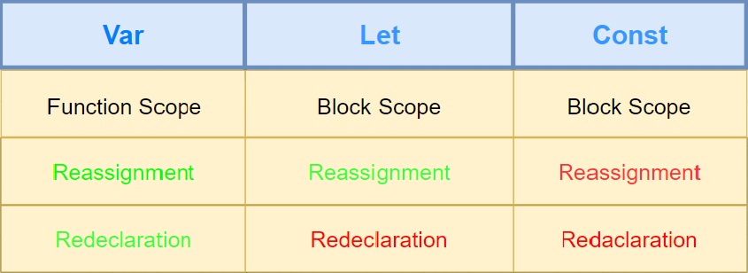
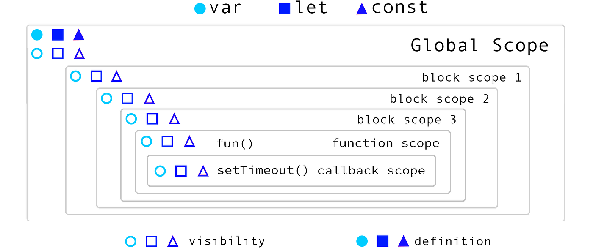
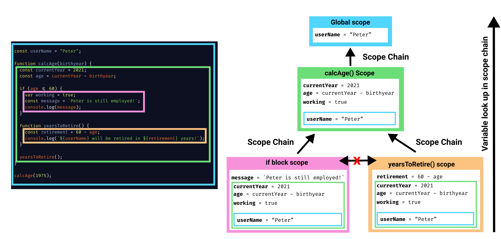
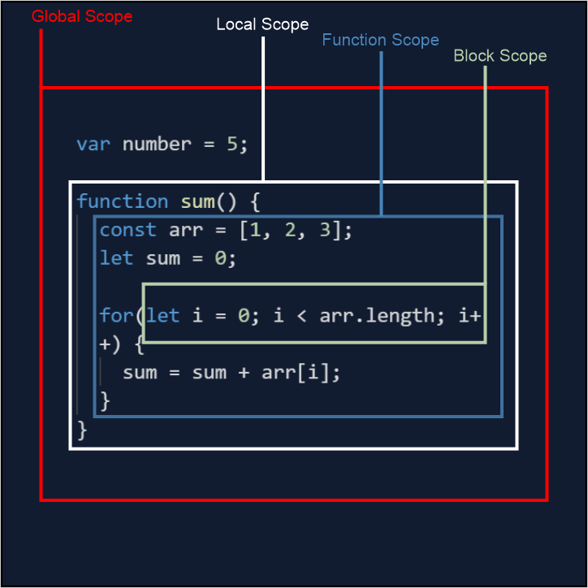

### lesson-3

- Scopes
- Loops 
- for loop
- while
- do while
- break keyword
- continue keyword
- Functions (Declaration)

- https://dev.to/hem/gif-cheatsheet-for-javascript-nullish-coalescing-operator-5537
- https://dev.to/nemo011/let-s-talk-scopes-in-javascript-8ol
- 
- 
- 
- 