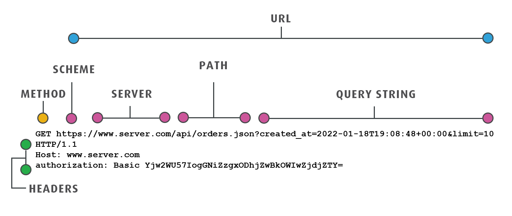

#### lesson-11
- data fetching
- async / await
- API params / request types
- Promise methods

- API





### JSON SERVER

1. npm i json-server
2. db.json
3.d.json ->
```
{
    "posts":[
        {
            "id":1,
            "title":"text1",
            "body":"text2"
        }
    ],
    "users":[
        {
            "id":1,
            "full_name":"Muhammaddiyor",
            "age":22
        }
    ]
}
```

4. npx json-server --watch db.json --port 3000 
5. npm run start