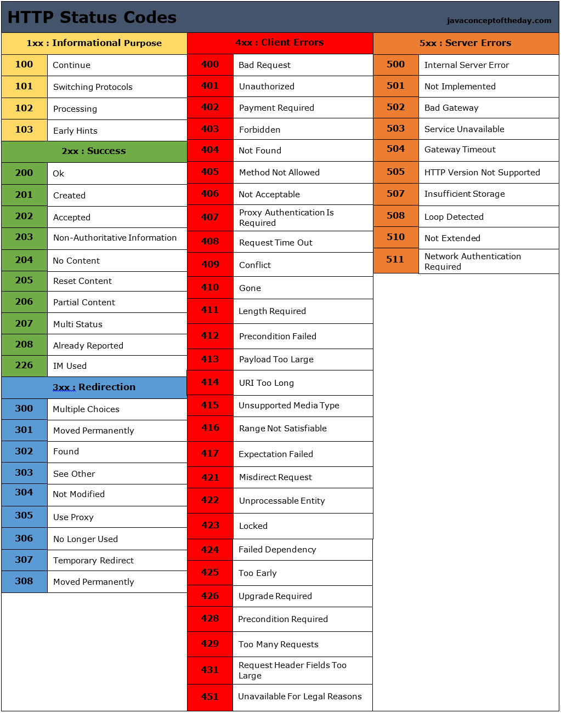
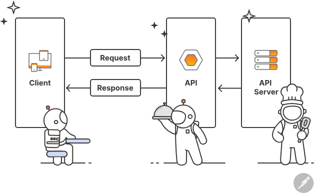

# lesson-9

- Promise

- resolve
- reject

- Promise state:

- pending    -> kutish holati
- rejected   -> failed
- fullfiled  -> successfully

- fetch
- try , catch

-- Status code 

https://javaconceptoftheday.com/http-status-codes-cheat-sheet/
# API

